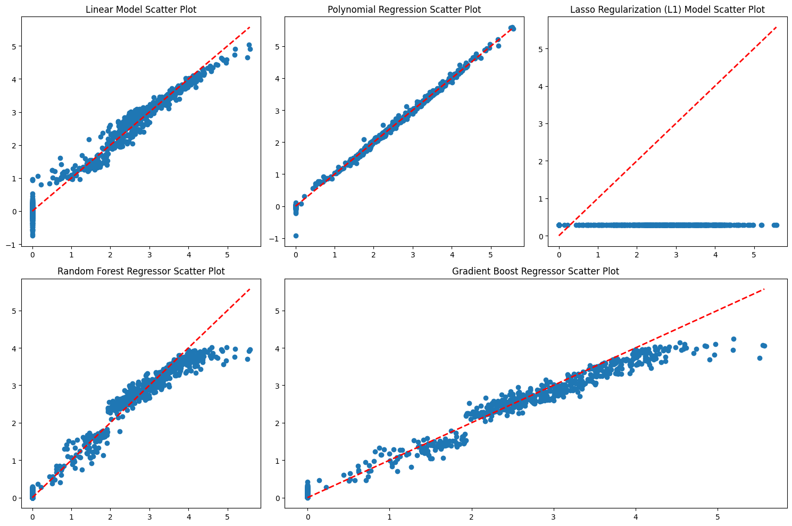

# Machine Learning Techniques for Customer Sentiment Prediction

This document outlines the machine learning techniques and models used to predict customer sentiment, specifically the `PageValues` metric, which serves as a proxy for the likelihood of a user generating revenue.

## Data Preprocessing

Before model training, the data undergoes several preprocessing steps to ensure it is suitable for machine learning algorithms:

- **Label Encoding**: Categorical features such as `Month`, `VisitorType`, and `Weekend` are converted into numerical format using `LabelEncoder`.
- **Standard Scaling**: The encoded categorical features are then scaled using `StandardScaler` to have a mean of 0 and a standard deviation of 1.
- **Power Transformation**: Numerical features are transformed using `PowerTransformer` with the 'yeo-johnson' method. This helps to stabilize variance and make the data more Gaussian-like, which is beneficial for many models.

## Machine Learning Models

Several regression models were trained and evaluated to predict `PageValues`. The performance of these models is visualized in the scatter plot below, which compares the predicted values against the actual values (`y_test`).

The following models were implemented:

### 1. Linear Regression

- **Description**: A baseline linear model that establishes a linear relationship between the features and the target variable (`PageValues`).
- **Purpose**: Used as a simple benchmark to evaluate the performance of more complex models.

### 2. Polynomial Regression

- **Description**: An extension of linear regression that models the relationship between the features and the target as an n-th degree polynomial.
- **Purpose**: Captures non-linear relationships in the data, which can improve predictive accuracy over a simple linear model.

### 3. Lasso Regularization (L1)

- **Description**: A linear regression model that includes an L1 regularization term. This technique can shrink some of the coefficient estimates to zero, effectively performing feature selection.
- **Purpose**: Helps to reduce model complexity and prevent overfitting by selecting only the most relevant features.

### 4. Random Forest Regressor

- **Description**: An ensemble learning method that constructs a multitude of decision trees at training time and outputs the mean prediction of the individual trees.
- **Purpose**: Provides high accuracy and robustness, and it is less prone to overfitting compared to a single decision tree.

### 5. Gradient Boosting Regressor

- **Description**: Another ensemble technique that builds models in a stage-wise fashion. It generalizes them by allowing optimization of an arbitrary differentiable loss function.
- **Purpose**: Often provides better predictive accuracy than Random Forest, though it can be more sensitive to hyperparameter tuning.

### RANSAC Regressor

- **Description**: The Random Sample Consensus (RANSAC) algorithm is used as a meta-estimator with both Linear Regression and Lasso models. RANSAC is an iterative method to estimate parameters of a mathematical model from a set of observed data that contains outliers.
- **Purpose**: Improves the robustness of the linear models by identifying and excluding outliers during the training process.

## Model Evaluation

The performance of each model is evaluated using the following metrics:

- **Root Mean Squared Error (RMSE)**: Measures the square root of the average of the squared differences between the predicted and actual values.
- **R-squared (R2) Score**: Represents the proportion of the variance for the dependent variable that's explained by the independent variables in the regression model.

By comparing these metrics across the different models, we can determine the most effective approach for predicting customer sentiment and potential revenue.
